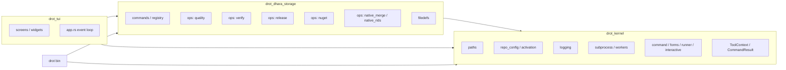

# DROT architecture

Operator tool crate layout for [dhara_repo_orchestration](https://github.com/D-Naveenz/dhara_repo_orchestration). Host products (for example [dhara_storage](https://github.com/D-Naveenz/dhara_storage)) pin this repo as a git submodule and consume `drot` / `drot_tui` artifacts or local builds.

Version authority is `[workspace.package].version` in this repo’s `Cargo.toml`.

## Crate DAG

**drot_kernel** (framework) ← **drot_dhara_storage** (product plugin) ← **drot** / **drot_tui** (hosts).

| Layer | Responsibility | Example |
|-------|----------------|---------|
| **Hosts** (`drot` / `drot_tui`) | Binary orchestration and TUI event loop | argv → dispatch; screens / widgets |
| **Plugin** (`drot_dhara_storage`) | Product commands, registry, domain ops, filedefs | `quality::run_clippy`, `release::run_cargo_release` |
| **Kernel** (`drot_kernel`) | Host APIs, paths, config activation, logging, subprocess helpers, weighted progress | `detect_config_drift`, `operation_progress` |

`app.rs` lives in the **binary / TUI host** crates; hosts must not depend on each other.

## TUI layout (`drot_tui`)

| Region | Role |
|--------|------|
| **Tasks tree** | Favorites + command hierarchy (`drot_kernel::interactive::tree`); compact explorer chrome; focused long labels marquee |
| **Tabs** | Info (Learn-style article), Options (fields + Reset), Troubleshooting (warn/error; auto-selected on run), System configs |
| **Action panel** | Unicode-capped Gauge-style progress bar with centered %, status line, single Run/Cancel toggle |
| **Chrome** | Title bar (version + repo), bottom command shortcut bar |

Progress lifecycle: [TUI operation progress](tui-progress.md).

## Path resolution

| Anchor | Resolution | Outputs |
|--------|------------|---------|
| `exe_path` / `tool_root` | Directory of the running binary | `logs/`, `output/`, `artifacts/`, `runtime.toml` |
| `repo_path` / `repo_root` | `-r` / `--repository`, then `runtime.toml`, then prompt | Host `dhara.config.toml`, product sources |

`is_repo_root` requires the host’s `dhara.config.toml`. `-r` accepts a repository directory or a path to that file.

## Related

- [Logging conventions](logging.md)
- [TUI operation progress](tui-progress.md)
- [AGENTS.md](../AGENTS.md)
- Host storage docs: [dhara_storage/docs](https://github.com/D-Naveenz/dhara_storage/tree/main/docs)
