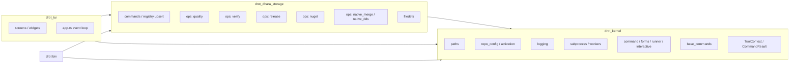

# DROT architecture

Operator tool crate layout for [dhara_repo_orchestration](https://github.com/D-Naveenz/dhara_repo_orchestration). Host products (for example [dhara_storage](https://github.com/D-Naveenz/dhara_storage)) pin this repo as a git submodule and consume `drot` / `drot_tui` artifacts or local builds.

Version authority is `[workspace.package].version` in this repo’s `Cargo.toml`.

## Crate DAG

**drot_kernel** (framework) ← **drot_dhara_storage** (product extension) ← **drot** / **drot_tui** (hosts).

| Layer | Responsibility | Example |
|-------|----------------|---------|
| **Hosts** (`drot` / `drot_tui`) | Binary orchestration and TUI event loop; Cargo feature selects the extension | argv → dispatch; screens / widgets |
| **Extension** (`drot_dhara_storage`) | Product commands, upsert onto base specs, domain ops, filedefs | `quality::run_clippy`, `release::run_cargo_release` |
| **Kernel** (`drot_kernel`) | Host APIs, base command stubs, registry, paths, config activation, logging | `register_base_commands`, `detect_config_drift` |

`app.rs` lives in the **binary / TUI host** crates; hosts must not depend on each other.

### Extension linking

- Exactly **one** product extension is linked at compile time (Cargo feature on the host, e.g. `extension-dhara-storage`).
- Kernel can build with **no** extension (`--no-default-features`); base commands appear as disabled until an extension upserts handlers.
- Runtime: `CommandRegistry` is the single source of truth for CLI help and TUI. Effective disable = `is_disabled || handler.is_none()`. Execute logs a WARN with `disabled_reason` (or a default message).

### Command registration order

1. `register_base_commands` (kernel stubs)
2. `register_extensions` → extension `upsert_command` / `add_section`
3. Hosts read the registry for help / tree / execute

## TUI layout (`drot_tui`)

| Region | Role |
|--------|------|
| **Tasks tree** | Favorites + command hierarchy (`drot_kernel::interactive::tree`); disabled leaves use muted color |
| **Tabs** | Info (Learn-style article + disable reason), Options (fields + Reset), Troubleshooting (warn/error; auto-selected on run), System configs |
| **Action panel** | Unicode-capped Gauge-style progress bar with centered %, status line, single Run/Cancel toggle |
| **Chrome** | Title bar (version + repo), bottom command shortcut bar |

Progress lifecycle: [TUI operation progress](tui-progress.md).

## Path resolution

| Anchor | Resolution | Outputs |
|--------|------------|---------|
| `exe_path` / `tool_root` | Directory of the running binary | `logs/`, `output/`, `artifacts/`, `runtime.toml` |
| `repo_path` / `repo_root` | `-r` / `--repository`, then `runtime.toml`, then prompt | Host `dhara.config.toml`, product sources |

`is_repo_root` requires the host’s `dhara.config.toml`. `-r` accepts a repository directory or a path to that file.

## Host wrapper build layout

When DROT is a host submodule, agent-facing source vs artifact paths are documented in [AGENTS.md → Local commands](../AGENTS.md#local-commands): edit under the submodule; host `run-drot` / `ensure-drot-dist` build into the host’s `target/dist/` via `CARGO_TARGET_DIR`.

## Related

- [Logging conventions](logging.md)
- [TUI operation progress](tui-progress.md)
- [AGENTS.md](../AGENTS.md)
- Host storage docs: [dhara_storage/docs](https://github.com/D-Naveenz/dhara_storage/tree/main/docs)
